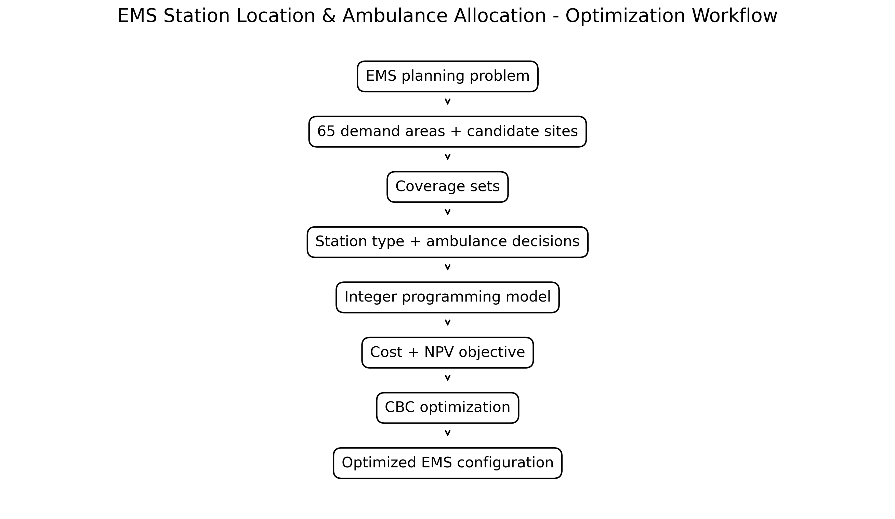

# Ambulance Station Location & Allocation Optimization

A mixed-integer optimization model for determining EMS station locations, station types, ambulance allocation, and emergency coverage across a network of 65 demand areas.

This project formulates an Emergency Medical Services (EMS) network design problem as a mathematical optimization model and solves it using Python, PuLP, and the CBC solver.

The model integrates:

- EMS station location
- Station type selection
- Ambulance allocation
- First-stage coverage
- Second-stage coverage
- Population-per-ambulance constraints
- Operating and response-related costs
- Net Present Value (NPV) over a five-year planning horizon

---

## Project Overview

Emergency Medical Service (EMS) systems must balance two important requirements:

1. Providing sufficient emergency coverage
2. Controlling the cost of infrastructure and ambulance resources

The purpose of this project is to formulate the EMS network design problem as a mathematical optimization problem and determine an efficient configuration of stations and ambulances while satisfying predefined coverage and capacity constraints.

Rather than analyzing the system only descriptively, the model directly produces operational decisions about:

- Where EMS stations should be located
- Which station type should be selected
- How many ambulances should be allocated to each station
- Which demand areas receive first-stage coverage
- Which demand areas receive second-stage coverage
- How the configuration affects the total modeled system cost

---

## Problem Definition

The project addresses an EMS facility location and resource allocation problem.

The model considers:

- **65 demand areas / candidate locations**
- **Two EMS station types**
- **Two ambulance types**
- **First-stage emergency coverage**
- **Second-stage emergency coverage**
- **Population-based ambulance capacity**
- **Station installation costs**
- **Ambulance purchasing costs**
- **Operating and response-related costs**
- **A five-year planning horizon**

The optimization model jointly determines station location and ambulance allocation rather than treating these decisions independently.

---

## Optimization Workflow

The overall modeling process is:


---

## Mathematical Optimization Model

The core of the project is a mixed-integer mathematical optimization model.

The model uses:

Binary decision variables for station selection and coverage assignment
Integer decision variables for ambulance allocation

The objective is to minimize the total modeled cost of the EMS network while satisfying coverage and ambulance-capacity constraints.

---

## Decision Variables
### First-Stage Assignment

For each demand area i and eligible station location j:

$$ X_{ij}^{A} $$

is a binary variable representing assignment of demand area i to a Type-A station at location j.

Similarly,

$$ X_{ij}^{B} $$

is a binary variable representing assignment of demand area i to a Type-B station at location j.

---

### Second-Stage Coverage
$$ X_{ij}^{S} $$

is a binary variable representing second-stage coverage of demand area i by station j.

These variables represent backup coverage relationships within the EMS network.

---

### Ambulance Allocation

The number of Type-A ambulances assigned to station j is represented by:

$$ n_j^A $$

and the number of Type-B ambulances by:

$$ n_j^B $$

Both ambulance allocation variables are integer decision variables.

---

# Objective Function

The optimization model minimizes the total modeled cost:

$$ \min Z = \sum_j CFA X_{jj}^{A} + \sum_j CFB X_{jj}^{B} + \sum_j CA n_j^A + \sum_j CB n_j^B + NPV $$

where:

* CFA = Type-A station cost
* CFB = Type-B station cost
* CA = Type-A ambulance cost
* CB = Type-B ambulance cost
* NPV = modeled Net Present Value of operating and response-related costs

The main cost parameters used in the implementation are:

| Parameter                  | Value       |
| -------------------------- | ----------- |
| Type-A ambulance cost      | 56,202      |
| Type-B ambulance cost      | 47,869      |
| Type-A station cost        | 494,152     |
| Type-B station cost        | 169,948     |


---

# Coverage Constraints
## First-Stage Coverage

Each demand area must be assigned to an eligible station for first-stage coverage.

Conceptually:

$$ \sum_{j \in F_i} \left( X_{ij}^{A} + X_{ij}^{B} \right) = 1 \qquad \forall i $$

where F_i represents the set of stations capable of providing first-stage coverage to demand area i.

This constraint ensures that every demand area receives primary coverage.

---
## Second-Stage Coverage

The model also incorporates second-stage coverage relationships.

For demand areas requiring backup coverage, the model assigns an eligible station for second-stage service.

The second-stage relationships are explicitly represented through the coverage parameters and binary decision variables in the implementation.

---

# Station Type Constraints

The model distinguishes between Type-A and Type-B stations.

A candidate location cannot simultaneously be selected as both station types.

Conceptually:

$$ X_{jj}^{A} + X_{jj}^{B} \leq 1 $$

for each candidate location j.

The model therefore selects the station type as part of the optimization decision.

---


# Station and Ambulance Consistency

Ambulance allocation must be consistent with the selected station configuration.

The model links station activation and ambulance allocation so that ambulances are allocated only to selected EMS station configurations.

This creates an integrated facility-location and resource-allocation model.

---

# Population-per-Ambulance Constraint

The model controls the population served by the ambulance resources assigned to each station.

The implementation uses:

$$ P_{min}=35,000 $$

and

$$ P_{max}=55,000 $$

people per ambulance.

The population assigned to each selected station must therefore remain within the specified range relative to its ambulance allocation.

This constraint connects:

* Population
* Demand-area assignment
* Station location
* Ambulance allocation

and prevents the optimization from assigning an excessive population to a limited ambulance capacity.

---
# Net Present Value (NPV)

The model incorporates the economic effect of the five-year planning horizon through a Net Present Value formulation.

The first-year modeled cost is calculated from the demand, population, response-related parameters, first-stage assignments, and second-stage coverage.

The NPV formulation is:

$$ NPV = C_1 \frac{ 1-(1+g)^T(1+h)^{-T} }{ h-g } $$

when:

$$ h \neq g $$

where:

* `C₁` = first-year modeled operating/response-related cost
  
* `g` = annual growth rate

* `h` = discount rate

* `T` = planning horizon

The implementation uses:

| Parameter                  | Value       |
| -------------------------- | ----------- |
| Planning horizon      | 5 years      |
| Discount rate     | 0.08      |
| Annual growth rate        | 0.0217    |
| Second-stage probability parameter        | 0.10     |
| Minimum population per ambulance     | 35,000      |
| Maximum population per ambulance        | 55,000    |
| Average daily calls        | 120    |

The NPV component allows the model to incorporate the economic effect of the EMS configuration over multiple years rather than evaluating only a single-year cost.

---

# Model Implementation

The optimization model was implemented in Python using PuLP.

The main modeling steps are:

**1.** Define the demand areas

**2.** Define population and demand parameters

**3.** Define candidate station locations

**4.** Define station eligibility

**5.** Define first-stage coverage relationships

**6.** Define second-stage coverage relationships

**7.** Create binary station and coverage variables

**8.** Create integer ambulance allocation variables

**9.** Add coverage constraints

**10.** Add station-type constraints

**11.** Add ambulance capacity constraints

**12.** Calculate the first-year modeled cost

**13.** Calculate NPV

**14.** Construct the objective function

**15.** Solve the mixed-integer optimization model

**16.** Extract the selected stations and ambulance allocation

The model is solved using the **CBC optimization solver** through PuLP.

---

# Optimization Results

The optimization run reported:

`Status: Optimal`

The resulting solution selects 14 EMS station locations from the 65 candidate areas.

Selected locations:

`4, 8, 11, 12, 17, 23, 24, 25, 29, 30, 32, 33, 47, 51`

The resulting ambulance configuration contains:

* 20 Type-A ambulances
* 9 Type-B ambulances
* 29 ambulances in total
---

# Selected Station Configuration

| Site	|Station Type	|Ambulances|	Population / Ambulance       |
| -------------------------- | ----------- | -------------------------- | ----------- |
|4	|B	|1	|50,863.00|
|8	|A	|3	|43,019.67|
|11	|A	|2	|54,677.00|
|12	|B	|1	|54,185.00|
|17	|A	|2	|51,392.50|
|23	|B	|1	|54,414.00|
|24	|B	|1	|54,724.00|
|25	|B	|1	|54,588.00|
|29	|A	|3	|42,015.33|
|30	|A	|10	|54,918.60|
|32	|B	|1	|53,884.00|
|33	|B	|1	|54,918.00|
|47	|B	|1	|54,079.00|
|51	|B	|1	|51,914.00|

---

# Ambulance Allocation

The optimized allocation of ambulances across the selected stations is shown below.

The model does not distribute ambulances equally among the selected stations.

Instead, the allocation depends on the population assigned to each station and the capacity constraints incorporated into the mathematical model.

Site 30 receives the largest allocation, with **10 Type-A ambulances.**

---

# Ambulance Fleet Composition

The optimized fleet consists of:

* 20 Type-A ambulances
* 9 Type-B ambulances
* 29 ambulances in total

The fleet composition is a direct output of the integrated station-location and resource-allocation model.

---

# Population Coverage

The population covered per ambulance varies across the selected stations while remaining within the modeled population-per-ambulance limits.

The model uses:

$$ 35,000 \leq Population/Ambulance \leq 55,000 $$

as the specified capacity range.

This constraint links ambulance capacity to the population served by each selected station.

---

# First-Stage Coverage

The number of first-stage covered demand areas varies between selected stations.

For example:

Site 30 provides first-stage coverage to a relatively large number of demand areas.
Site 47 provides coverage to 6 demand areas.
Sites 8, 11, and 29 each provide coverage to 4 demand areas.
Other selected stations provide coverage to smaller groups of demand areas.

This demonstrates that the optimization simultaneously considers station location, coverage relationships, and ambulance allocation.


---

# Key Results
|Metric |	Result       |
| -------------------------- | ----------- |
|Demand areas	|65|
|Planning horizon	|5 years|
|Selected stations	|14|
|Type-A ambulances	|20|
|Type-B ambulances	|9|
|Total ambulances	|29|
|Minimum population / ambulance	|35,000|
|Maximum population / ambulance	|55,000|
|Solver status	|Optimal|
|Solver	|CBC|

---

# Decision-Making Perspective

The main value of this project is that it converts an operational healthcare problem into a mathematical decision model.

Instead of only describing historical data, the model produces decisions about:

```text
EMS Demand
    ↓
Coverage Requirements
    ↓
Facility Location
    ↓
Station Type Selection
    ↓
Ambulance Allocation
    ↓
Cost & NPV
    ↓
Optimized EMS Network
```

This type of modeling can support strategic decisions involving:

* Facility location
* Resource allocation
* Healthcare operations
* Emergency service planning
* Network design
* Cost optimization
* Limitations

The model is dependent on the assumptions and parameters used in the implementation.

---

# How to Run
1. Clone the repository
   
`git clone https://github.com/MobinaHaghshenas/ambulance-station-location-optimization.git`

`cd ambulance-station-location-optimization`

2. Install dependencies

`pip install -r requirements.txt`

3. Run the optimization model

`python src/ambulance_station_location_optimization.py`

The script builds the optimization model, solves it using the CBC solver, and prints the resulting station configuration and ambulance allocation.
