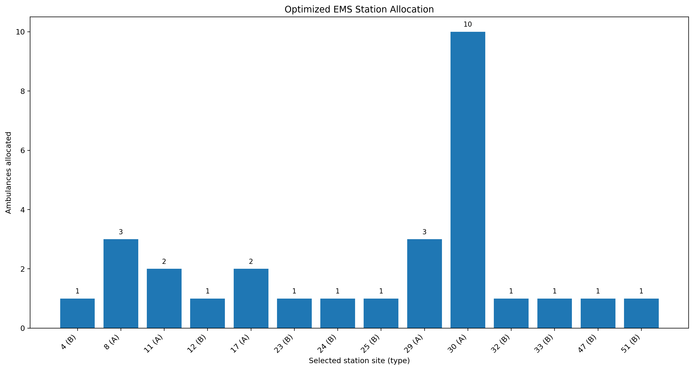
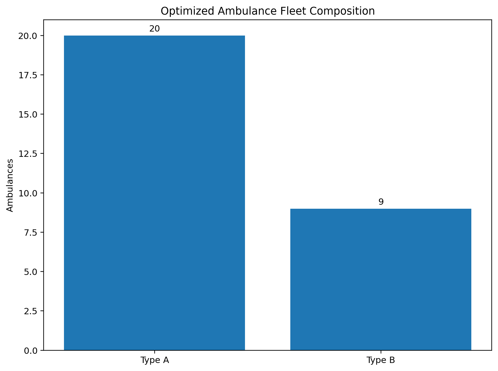
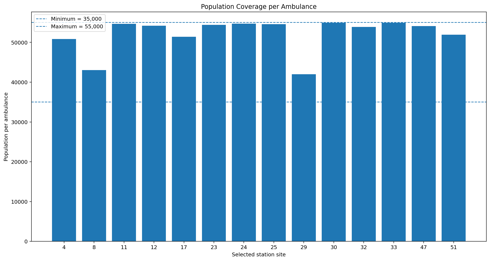
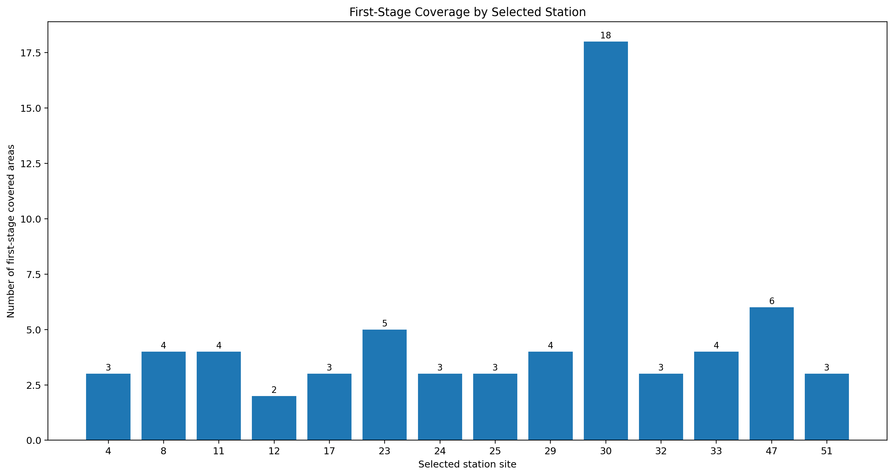

# Results

This folder contains the main visual outputs of the ambulance station location and allocation optimization model.

## Optimization Workflow

The workflow summarizes the main steps from problem formulation to the final optimized station and ambulance configuration.

## Station Allocation

The optimization identifies the selected station locations and their corresponding station types.

## Ambulance Type Distribution

The optimized solution assigns ambulances across two ambulance types.

## Population Coverage

This figure shows the population served per ambulance for the selected stations and allows comparison with the model's population-per-ambulance constraints.

## Coverage by Station

The final visualization shows the coverage associated with each selected station.

